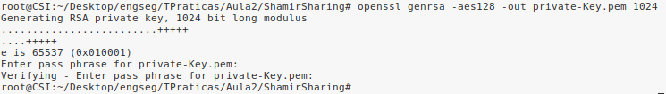
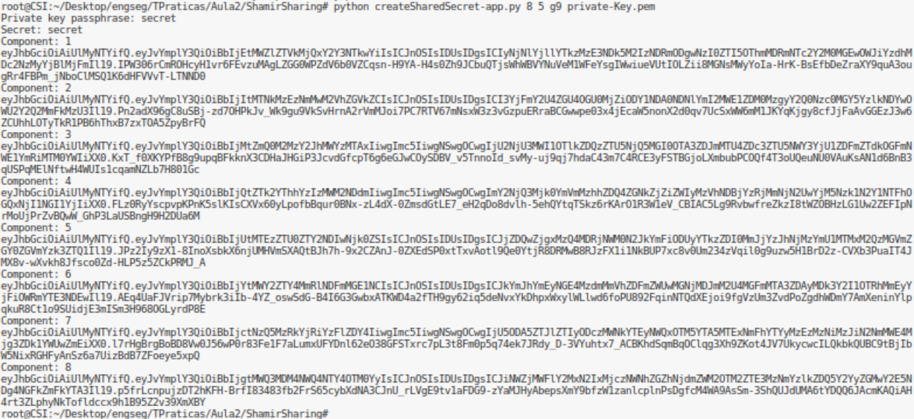
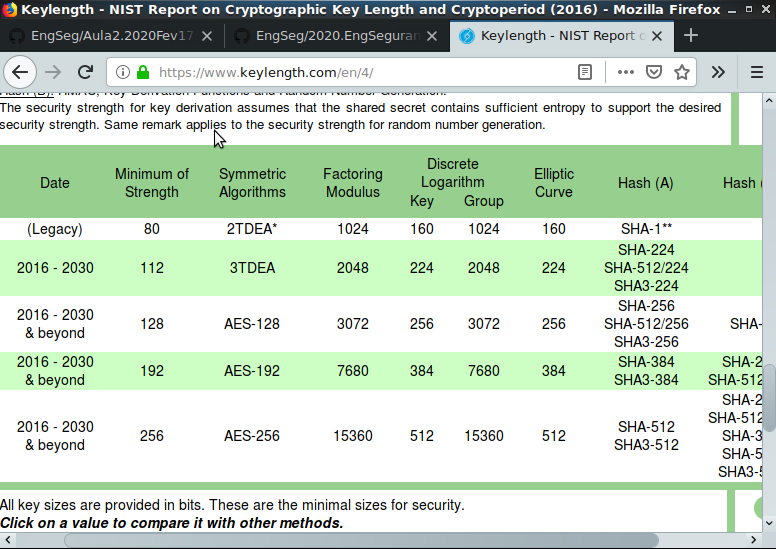
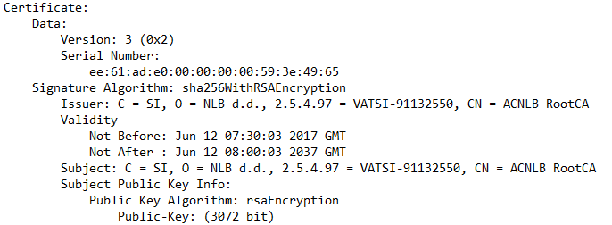
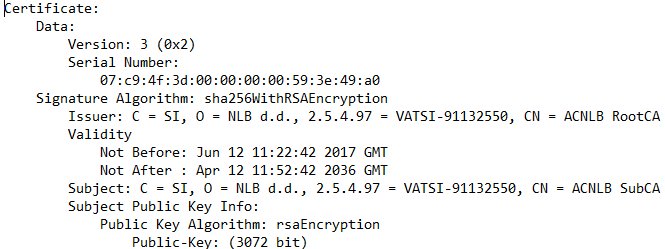
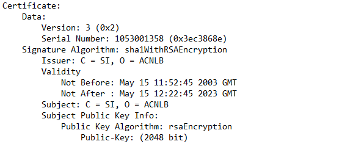

# 1. Números aleatórios/pseudoaleatórios

**Pergunta P1.1**

Os geradores de números aleatórios podem ser obtidos baseando-se para tal em fenómenos físicos, como ruído atmosférico, ruído térmico e outro fenómenos eletromagnéticos e quanticos, ou então, através de algoritmos computacionais.

Os sistemas UNIX tem duas fontes de aleatoriedade: **/dev/random** e **/dev/urandom**.

* **/dev/random** - retorna bytes aleatórios gerados pela pool de entropia existente. Quando esta se encontra vazia, as leituras /dev/random são bloqueadas até ser obtido mais ruído do ambiente.

* **/dev/urandom** - ao contrário do caso anterior, este reusa a pool interna para produzir mais bits pseudoaleatórios.

Comandos a analisar:
1. head -c 32 /dev/random | openssl enc -base64
2. head -c 64 /dev/random | openssl enc -base64
3. head -c 1024 /dev/random | openssl enc -base64
4. head -c 1024 /dev/urandom | openssl enc -base64

Nos comandos 1, 2 e 4 os resultados são obtidos instantâneamente, sendo a principal diferença o número de bytes. O mesmo não se verica no comando 3, devorando este mais tempo para gerar o resultado, mesmo possuindo igual número de bytes que o comando 4. 

Nos comandos 1, 2 e 3 (32, 64 e 1024 bytes, respetivamente) que utilizam a fonte /dev/random, fonte esta que depende de eventos que causem entropia, o que faz com que o resultado demore mais tempo a ser gerardo, e quantos mais bytes tiver mais demorará a ser gerado.

No comando 4 (1024 bytes) a fonte de aletoriedade é o /dev/urandom, pelo facto desta não bloqueiar torna-se mais rápida que a anterior, o que faz com que o resultado seja gerado mais rápido, quando em comparação com o comando 3.

**Pergunta P1.2**

Comandos a analisar:

3. head -c 1024 /dev/random | openssl enc -base64
4. head -c 1024 /dev/urandom | openssl enc -base64

Comparando a execução do comando 3 com a mesma do exercício anterior, nota-se uma redução significativa no tempo de execução. Esta deve-se ao facto de que quando a fonte /dev/random é executada, passa a existir a entropia necessária para que se produzam os 1024 bytes pedidos. Já quando comparando a execução do comando 4 com a mesma do exercício anterior, esta não sofreu alterações no tempo de execução.

**Pergunta P1.3**

A razão pela qual o output do programa de geração de segredo aleatório conter apenas letras e dígitos deve-se à função *generateSecret(secretLength)*:

*def generateSecret(secretLength):*
    """
    This function generates a random string with secretLength characters (ascii_letters and digits).
    Args:
        secretLength (int): number of characters of the string
    Returns:
        Random string with secretLength characters (ascii_letters and digits)
    """
    l = 0
    secret = ""
    while (l < secretLength):
        s = utils.generateRandomData(secretLength - l)
        for c in s:
            if (c in (string.ascii_letters + string.digits) and l < secretLength): # printable character
                l += 1
                secret += c
    return secret

# Partilha/Divisão de Segredo

## 2.1 A

Ao observar o comando 
> python createSharedSecret-app.py number_of_shares quorum uid private-key.pem
observamos que precisavamos de criar uma chave privada, para isso recorremos ao comando 
> openssl genrsa -aes128 -out private-key.pem 1024
para obtermos a chave necessária.

Nota: chave para aceder á chave private-Key.pem => secret

Em seguida tratamos de gerar os códigos pedidos, nesta geração utilizamos o número 8 como o number_of_shares, 5 como o quorum e o uid foi g9 visto sermos o grupo 9.

## 2.1 B

O ficheiro recoverSecretFromComponents-app.py permite recuperar o segredo com apenas 5 dos código (o número 5 deve-se ao quorum escolhido quando foram criados os códigos). Já o ficheiro recoverSecretFromAllComponents-app.py permite apenas recuperar o segredo caso forneçamos todas as 8 componentes (8 foi o número de componentes escolhidas a serem geradas - number_of_shares). No entanto este ultimo ficheiro é necessário caso tenhamos necessidade de alterar o segredo, visto que são necessárias as 8 componentes para possibilitar a alteração do segredo e redistribuição de novas chaves.

# Pergunta 4

A Entidade Certificadora correspodente a Eslovenia para o serviço de emissão de certificados digitais qualificados  para pessoa fisica designado por "Qcert for Esig" em que se pretende verificar se usam tamanho de chaves corretos e algoritmos é a "NLB d.d.".

Esta entidade contem várias CAs:

- AC NLB
- ACNLB subCA
- ACNLB RootCA

O algoritmo utilizado pela três é rsaEncryption. Ao usar o RSA signfica que o tamanho da chave tem que ter em conta o problema de factorização de grandes números modulo N, em que N é o tamanho da chave. Segundo a recomendação do NIST como pode ser visto pela figura seguinte, o tamanho minimo recomendado para que seja viavel desde o ano atual ate 2030 é chaves de 2048 bits.

A primeira AC NLB utiliza uma chave de tamanho 2048,isto é, o tamanho minimo recomendado. As outras duas (ACNLB subCA, ACNLB RootCA) utilizam um tamanho de 3072 bits que segundo o NIST são viaveis ate alguns anos depois de 2030.

