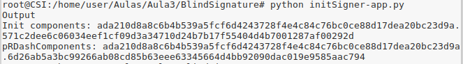

### Exercício 1 - Assinaturas cegas (Blind signatures) baseadas no Elliptic Curve Discrete Logarithm Problem (ECDLP)

#### Experiência 1.1

* **openssl ecparam -name prime256v1 -genkey -noout -out key.pem**

* **openssl req -key key.pem -new -x509 -days 365 -out key.crt**

#### Experiência 1.2

* **Inicialização** - openssl ecparam -name prime256v1 -genkey -noout -out key.pem

* **Ofuscação** - openssl ecparam -name prime256v1 -genkey -noout -out key.pem

* **Assinatura** - openssl ecparam -name prime256v1 -genkey -noout -out key.pem

* **Desofuscação**- openssl ecparam -name prime256v1 -genkey -noout -out key.pem

* **Verificação** - openssl ecparam -name prime256v1 -genkey -noout -out key.pem

### Pergunta 1.1

Assinante:

* [init-app.py](https://github.com/uminho-miei-engseg-19-20/Grupo9/blob/master/Aula3/questao1/P1.1/init-app.py)

* [blindSignature-app.py](https://github.com/uminho-miei-engseg-19-20/Grupo9/blob/master/Aula3/questao1/P1.1/blindSignature-app.py)

Requerente:

* [ofusca-app.py](https://github.com/uminho-miei-engseg-19-20/Grupo9/blob/master/Aula3/questao1/P1.1/ofusca-app.py)

* [desofusca-app.py](https://github.com/uminho-miei-engseg-19-20/Grupo9/blob/master/Aula3/questao1/P1.1/desofusca-app.py)

Verificador:

* [verify-app.py](https://github.com/uminho-miei-engseg-19-20/Grupo9/blob/master/Aula3/questao1/P1.1/verify-app.py)

