#Análise do site www.portugual.gov.pt

Q 2.1-

Este site exibe uma segurança elevada (A+).
Analizando o "Summary", podemos ver que este site funciona apenas com suporte SNI que faz com que um cliente indique com quem este se está a tentar comunicar no inicio da fase de "Handshake". Adicionalmente podemos ver que este servidor permite a utilização do TLS 1.3 e HTTP Transport Security (HSTS) com duração longa.

Debruçando-nos sobre o certificado do site podemos ver que este possui um certificado transparente e de confiança que não possui DNS CAA.

Por fim podemos ver que no caso das Cipher Suites para TLS 1.3 temos 3 opções válidas fortes de cifras e para TLS 1.2 temos 2 opções fortes e 12 fracas, vale ressalvar que o tipo de cifras preferido pelo site são as cifras fortes seguidas das fracas.

Este site permitiu a realização de todas as Handshake Simulations.

Acerca dos detalhes de protocolo, este site permite uma renegociação segura, possui downgrade_attack_prevention (TLS_FALLBACK_SCSV), forward sececy robusta e OCSP stapling conhecido como "TLS Certificate Status Request" um standard para verificar a revogação dos certificados digitais X.509.

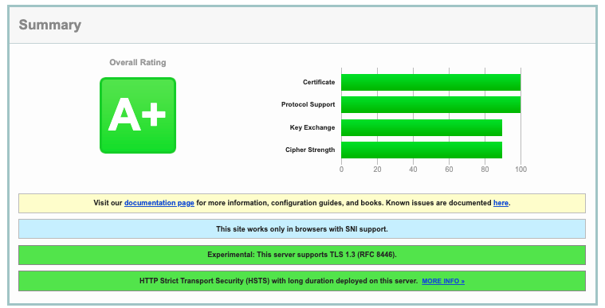
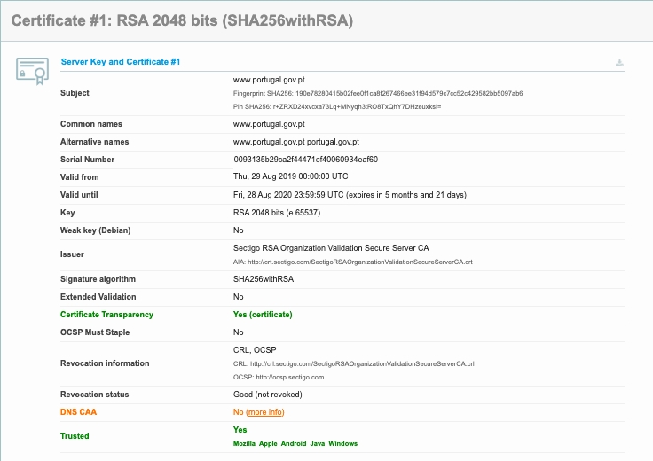
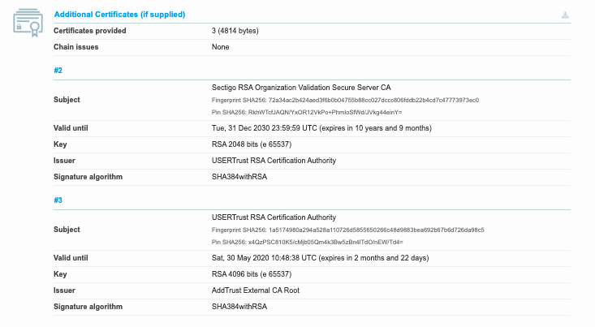
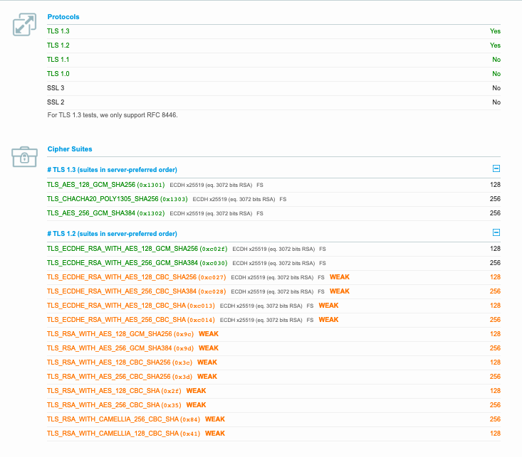
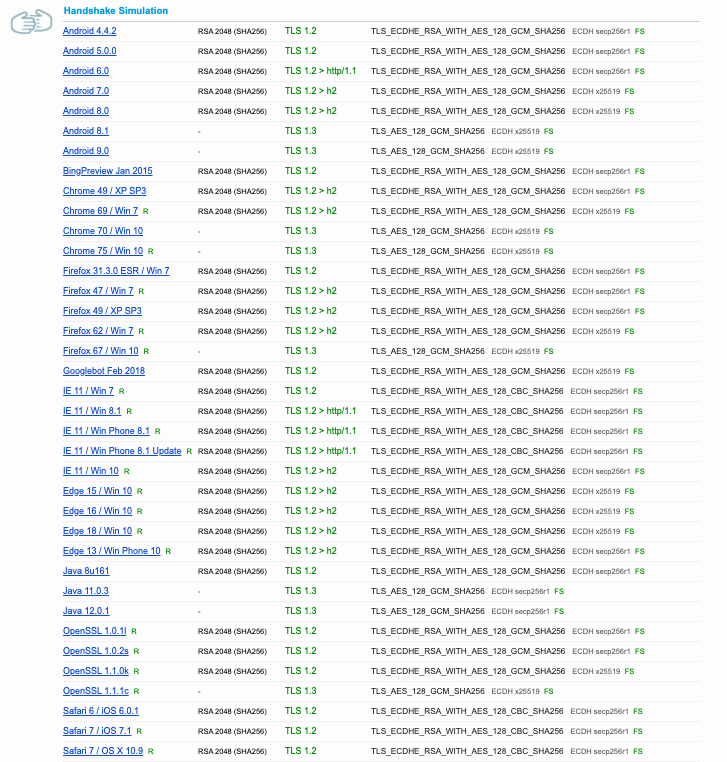
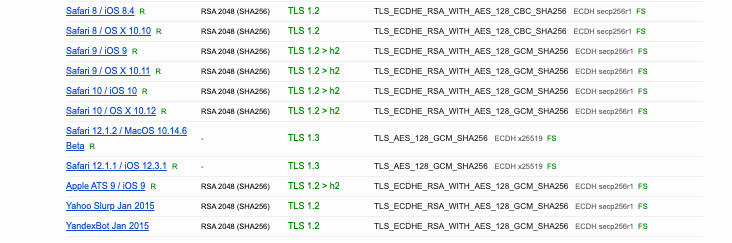
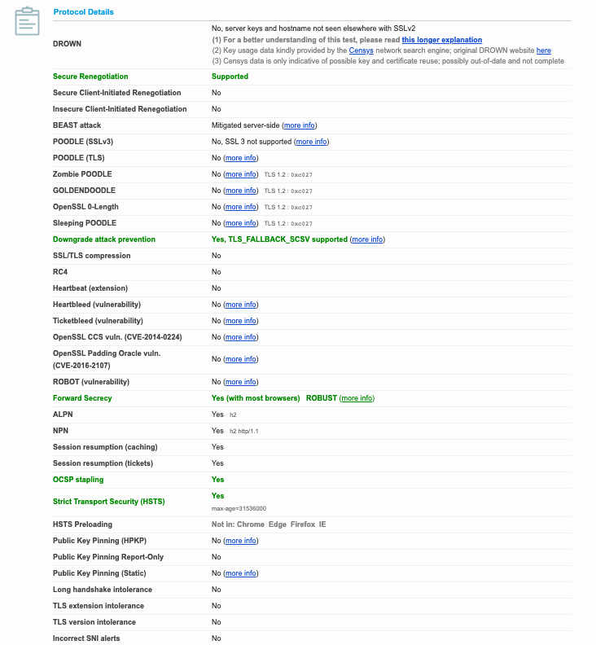
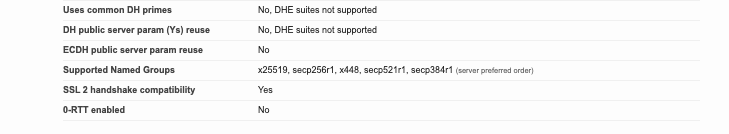

### P2.1

#### 1.

### Banco N26
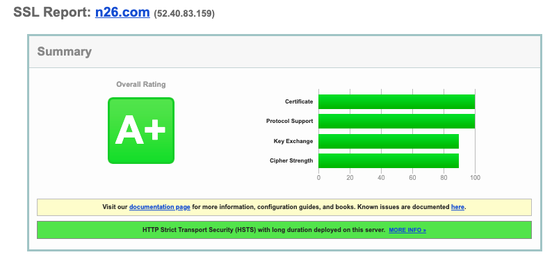
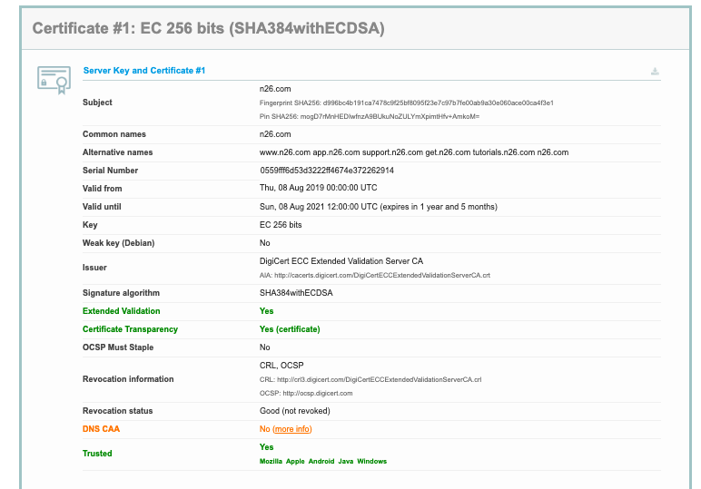
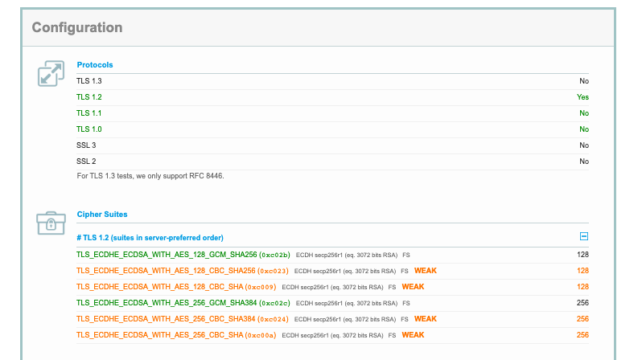
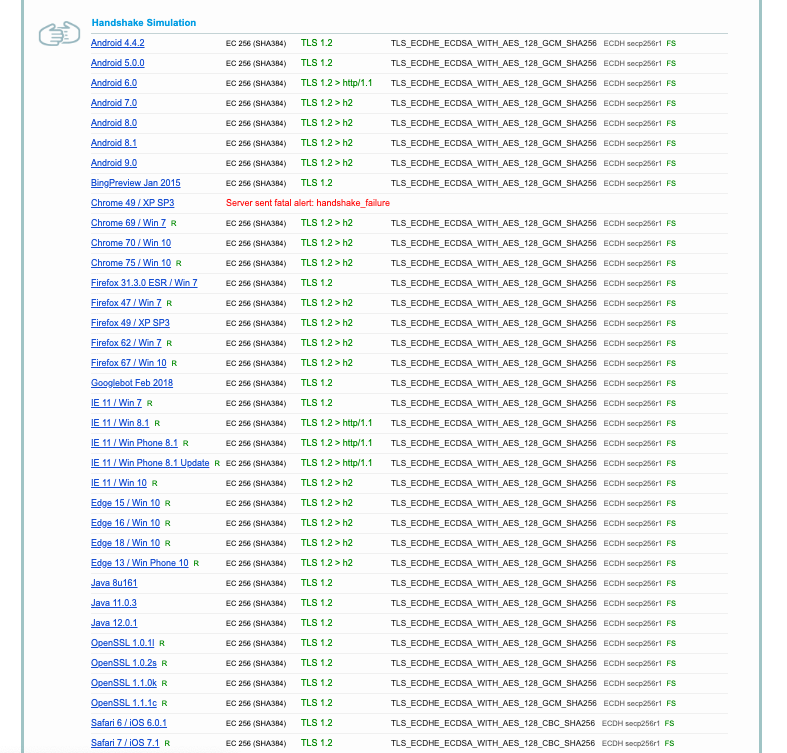
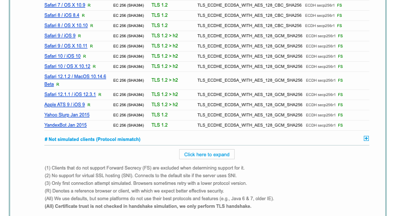
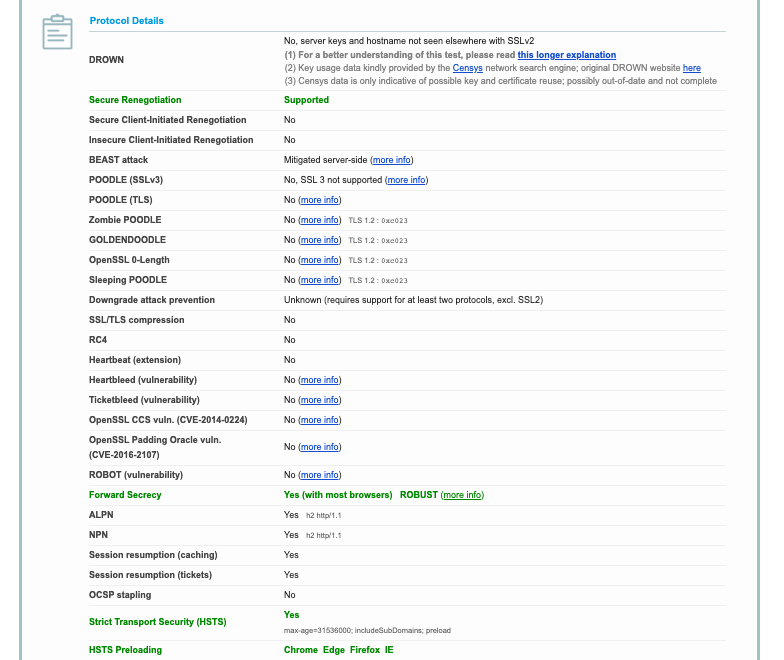
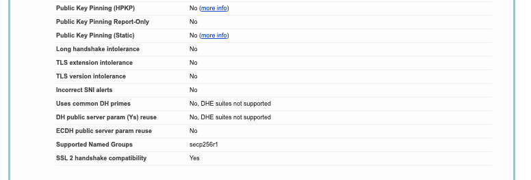
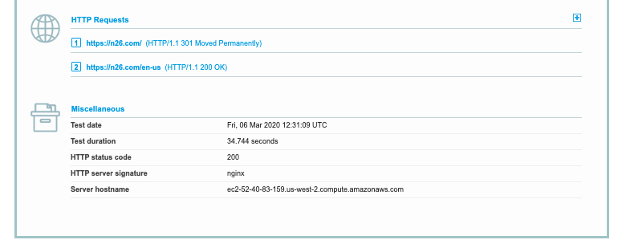

### Banco Santander
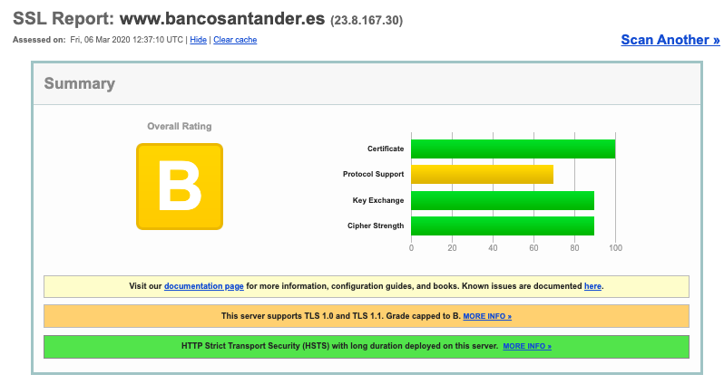
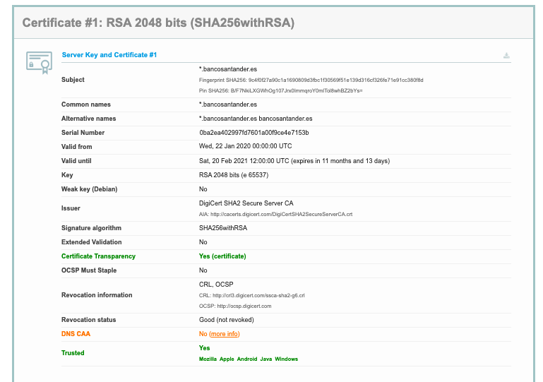
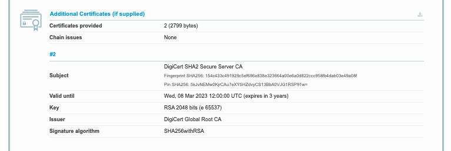
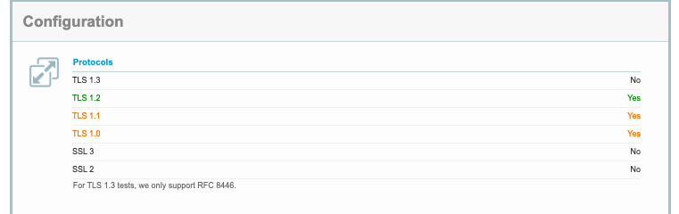
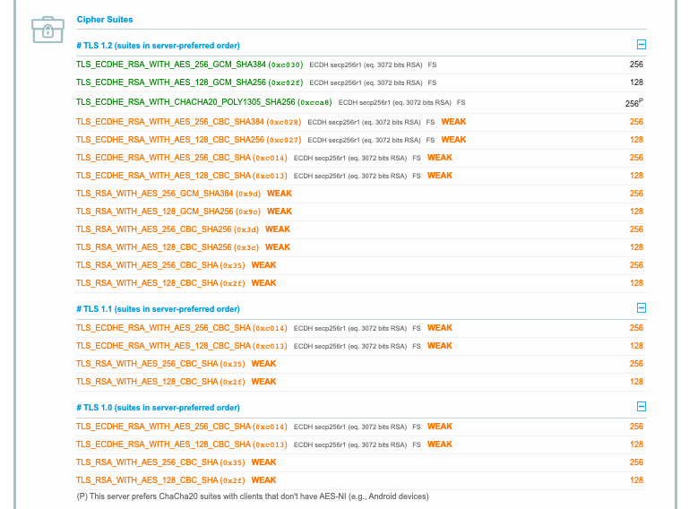
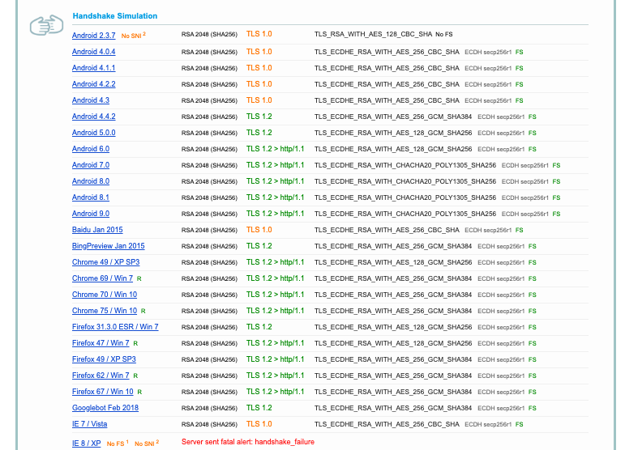
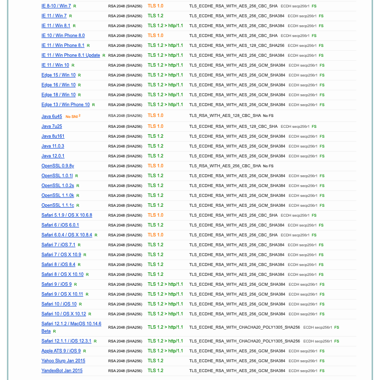
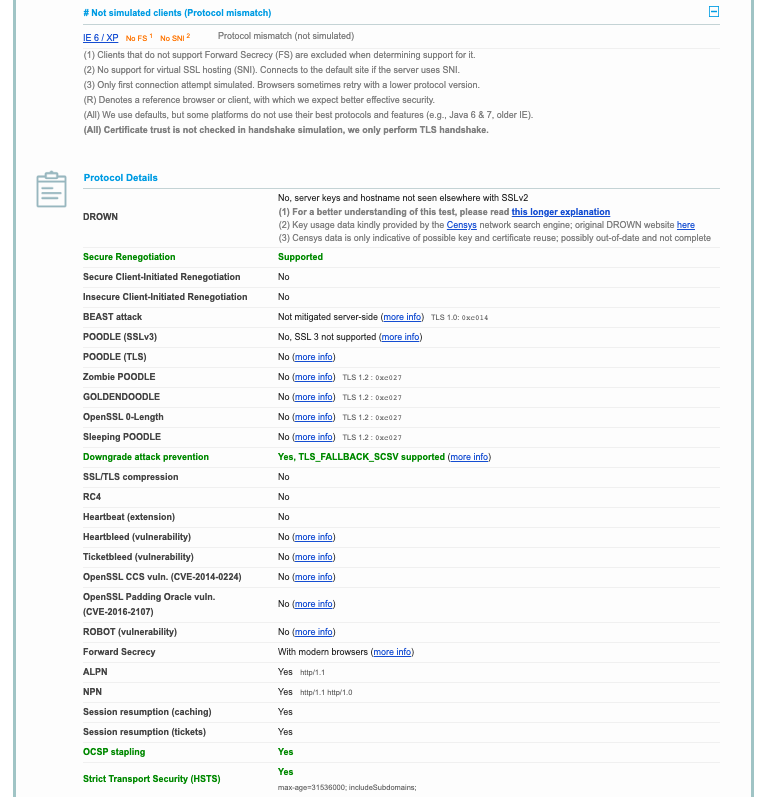
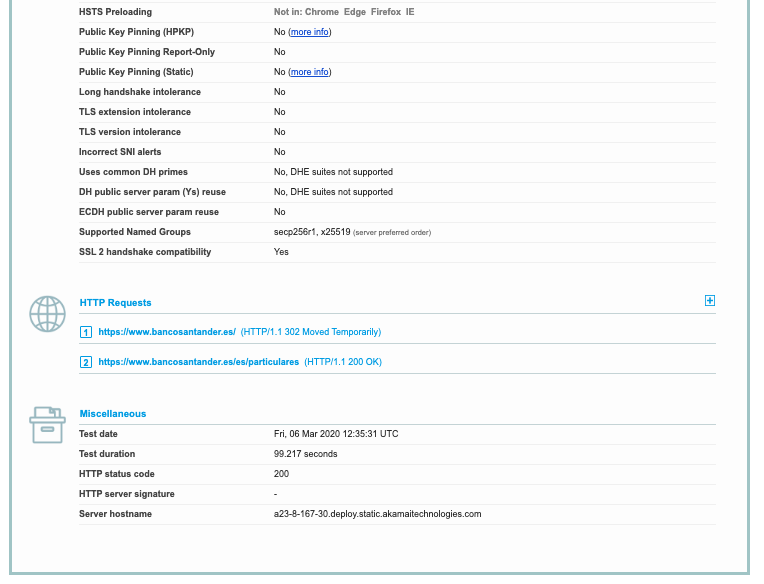

#### 2. 

O pior servidor é obviamente o do banco Santander obtendo uma classificação B. Este possui um certificado de confiança transparente e utiliza alguns dos algoritmos de criptografia mais fortes atuais para a comunicação sobre TLS 1.2. No entanto, este permite comunicações sobre TLS 1.0 e tanto para estas como aquelas sobre TLS 1.1 este não utiliza nenhuma criptografia forte. É importante ressalvar que este servidor não suporta TLS 1.3.

Os testes de Handshake feitos como as versões de Android até á 4.3, baidu 2015, windows Vista e 7, windows phone 8.0, openSSL 0.9, Java6u45, Java7u25, Safari 5.1.9 e Safari 6.0.4 utilizam TLS 1.0 para comunicar com o servidor, pondo em perigo a comunicação.

#### 3.

O significado desta informação alerta para o resultado da tentativa de utilizar este ataque (heartbleed) para obter informação importante do servidor. Um servidor que corra uma versão do OpenSSL 1.0.1 está muito provávelmente vulnerável. E caso não uses Forward Secrecy os dados que anteriormente possam ter sido roubados não estão seguros.
No caso do nosso servidor, este ataque não funciona.
