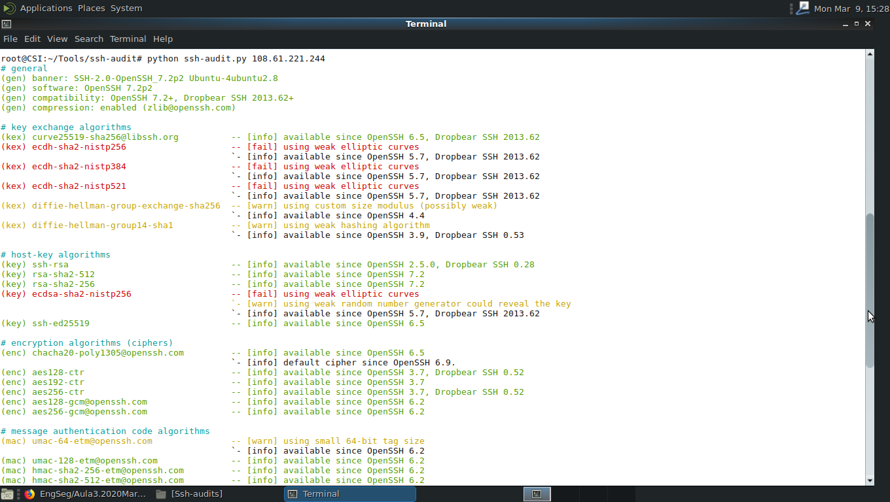
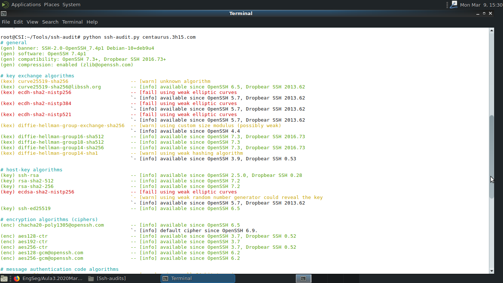
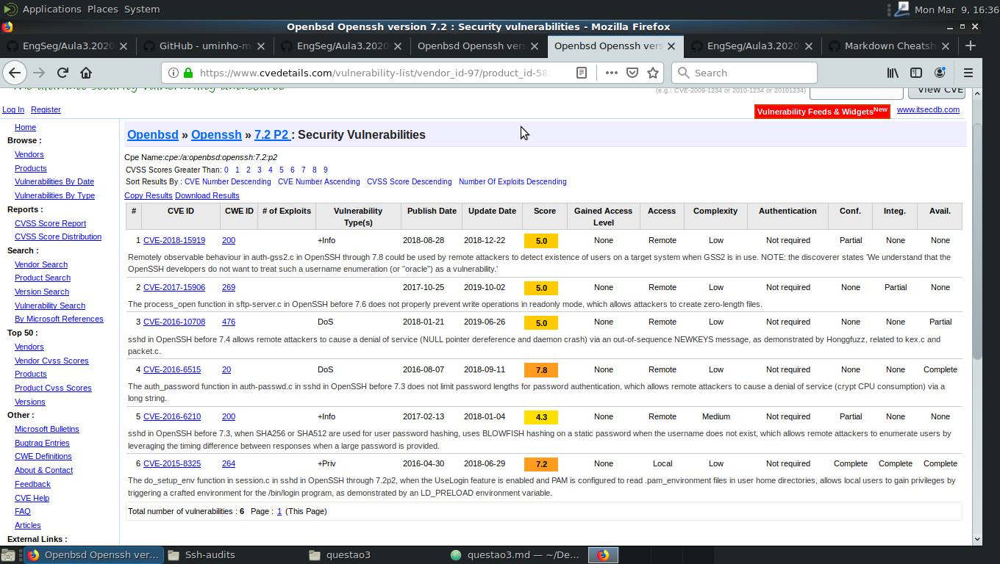
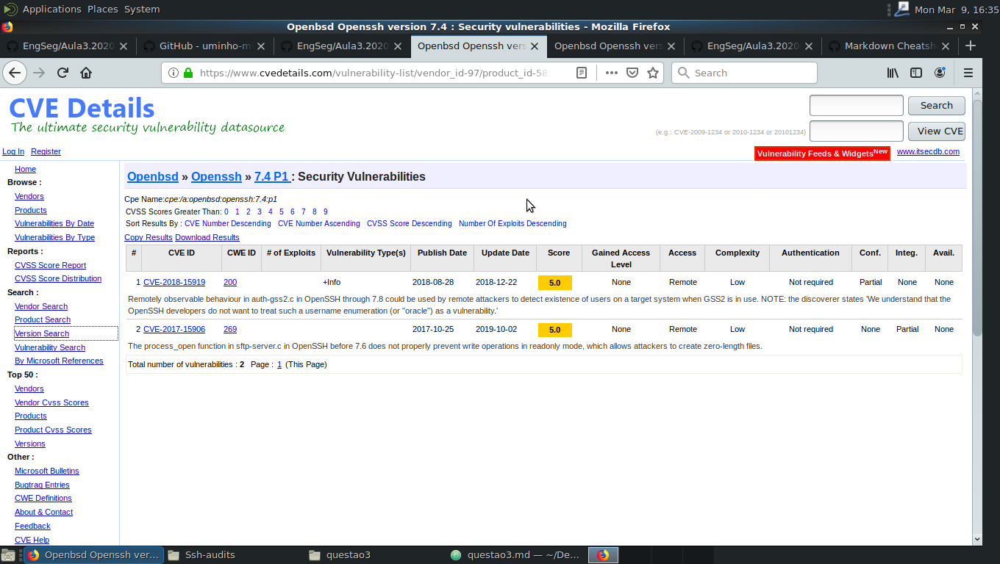
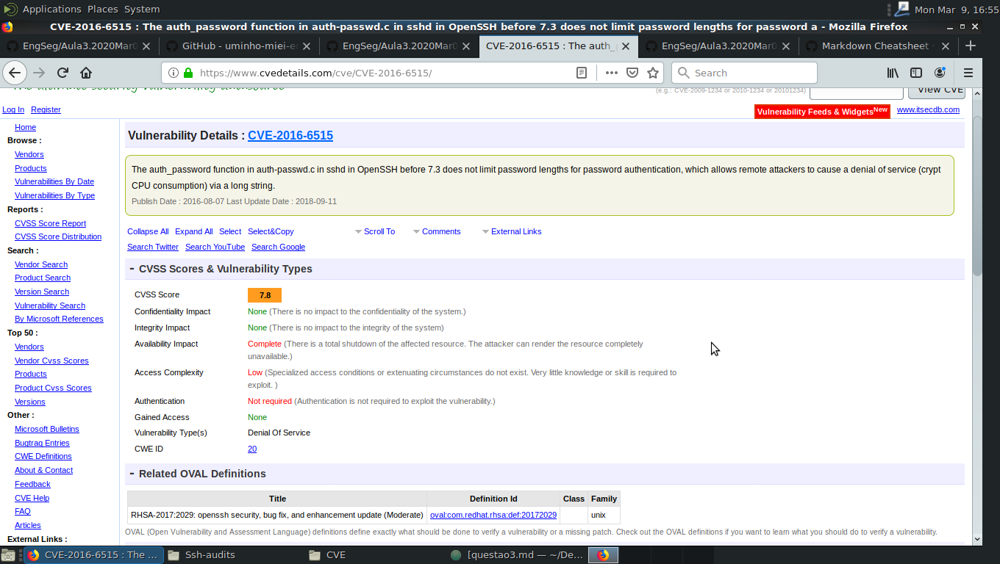

# Pergunta 3.1

As empresas comerciais escolhidas foram pesquisadas da lista disponibilizadas pelo [Shodan](www.shodan.io) com os filtros:
> **port:22 country:"GB" city:London**.

Estas foram as seguintes:

+ Choppa,LLC - Hostname 108.61.221.244.vultr.com
+ DigitalOcean - Hostname centaurus.3h15.com

Após realizar o ssh-audit nestes dois servidores obteve-se os seguinte resultados:

## Software e Versão

O servidor da empresa Choppa utiliza a versão 7.2p2 do OpenSSH numa máquina Ubuntu. Enquanto ao servidor da DigitalOcean utiliza a versão 7.4p1 do OpenSSH numa máquina com Debian-10.

## Vulnerabilidades

Recorrendo a funcionalidade de pesquisa do site [CVEDetails](www.cvedetails.com) pesquisou-se o número de Vulnerabilidades existentes nas duas versões do OpenSSH utilizadas pelos servidores anteriormente considerados. Assim obteve-se que:

+ A versão 7.2 P2 tem 6 Vulnerabilidades conhecidas

+ A versão 7.4 P1 tem 2 Vulberabilidades conhecidas

Concluindo a versão 7.2 P2 têm mais vulnerabilidades. Também tem a Vulberabilidades mais grave visto que apresenta a vulnerabilidades com identificador CVE-2016-6515 com Score 7.8 segundo o CVSS.

Esta vulnerabilidade é do tipo *DoS* ( Denial of Service), ou seja, podendo impedir a utilização do serviço de SSH do servidor. O ataque é simples visto que o Software não limita o tamanho das password quando as autentifica, o que permite consumir muita potência de CPU enviando uma String com muitos caráteres ao serviço. Assim, impedindo ou relentando a utilização do serviço por outros utilizadores.
Podendo-se assim considerar uma Vulberabilidades bastante grave.

