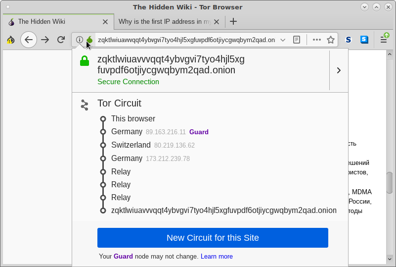

# Pergunta 1

O comando anonsurf como é dito pelo próprio comando quando se inicia redireciona todo o tráfego através do Tor.

Ao utilizar o comando sem realizar nenhum tipo de modificação aos ficheiros de configuração do Tor então não se pode garantir que o Exit Node esteja localizado nos EUA.

Segundo o próprio protocolo Tor, os nodos são escolhidos aleatoriamente da lista descarregada do Directory Server, e que, por default muda para um novo circuito cada minuto para impedir relacionar certo trafégo com certo utilizador.

No entanto,caso se adicione a linha:

> ExitNodes {us}

No ficheiro de configuração torrc localizado no sistema Debian/Ubuntu em /etc/tor/torrc. Apesar de não recomendável, pode-se garantir que o Exit Node esteja sempre localizado nos EUA.

Isto é possível visto que o OP (Onion Proxy) localizado na máquina que executa o Tor só precisa de escolher o Exit node que seja de EUA pertencente a lista recebida e mantida pelos Directory Servers.

# Pergunta 2

Para o site Hidden Wiki podemos ver na imagem seguinte o circuito gerado para conetar com o mesmo.

Pela imagem podemos ver que é usado um Guard na Alemanha, um na Suiça e outra na Alemanha como intermedios mais três nodos como relay antes de chegar ao site pretendido.

Para providenciar o serviço, nesta caso o site com várias propriedades desejadas como:

+ Permitir o serviço de filtrar os requests de conexão para impedir ataques de DoS.

+ Esconder a localização do serviço.

Para tal, o protocolo usa os Introduction Points e os Rendezvous Points para estabelecer uma ligação entre o Serviço e o Cliente. Através de vários estabelecimentos de circuitos Tor, conetam-se ambos ao Rendezvous Point escolhido pelo Cliente sem nenhum saber a localização do Outro. Ou seja, um circuito Tor do Cliente para o Rendezvous Points e outro circuito do Servidor que fornece o Serviço ao Rendezvous Points. Como um circuito Tor tem normalmente 3 nodos ao utilizar dois circuitos signfica que tem 6 nodos. Sendo os do Servidor utilizados como Relay Nodes.
