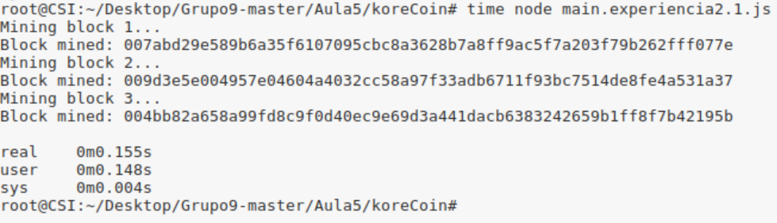
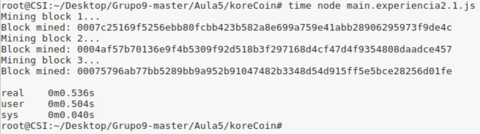
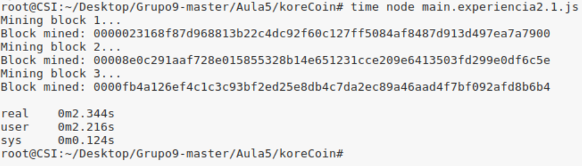
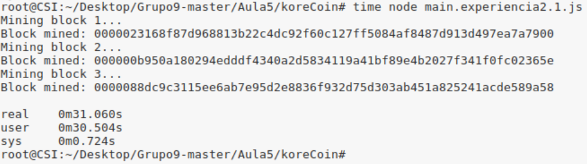

###Pergunta 2.1

Em seguida apresenta-se os tempos de mineração sobre os 3 blocos com dificuldade 2,3,4 e 5 respetivamente.


Dificuldade 2:


Dificuldade 3:


Dificuldade 4:


Dificuldade 5:



Emseguida temos uma tabela para melhor visualizarmos os valores demorados a realizar a "proof of work".

|DIficuldade\Tempo |real  | Utilizador| Sistema |
|------------------|------|-----------|---------|
|  Dificuldade 2   |0.155 |0.148.     |0.004    |
|  Dificuldade 3   |0.536 |0.504      |0.040    |
|  Dificuldade 4   |2.344 |2.216      |0.124    |
|  Dificuldade 5   |31.060|30.504     |0.724    |


Observndo a tabela é possível concluir que o tempo gasto a minerar os blocos aumenta de forma exponecial com a dificuldade.
Note-se que a dificuldade representa o número e 0 a aparecerem na hash antes de qualquer outro valor diferente de 0. Podemos concluir daqui que quantos mais zeros forem necessários  menor é o número de nonces que dão o resultado esperado.
No entatnto apesar de parecer que nodos com maior poder computacional ganham a disputa na procura de nonces, nem sempre isto se verifica dado que depende da probabilidade de encontrar um nonce que cumpra os requisitos e não de o calcular.


###Pergunta 2.2

1.  

 O algoritmo de "proof of work" é dado pelo seguinte código :
```
def proof_of_work(last_proof):

  incrementor = last_proof + 1

  while not (incrementor % 9 == 0 and incrementor % last_proof == 0):
    incrementor += 1

  return incrementor
```
Basicamente vamos incrementar um contador chamado incrementor enquanto este não for divisivel por 9 e pelo proof of work anterior.
Convêm sublinhar que o "proof of work" inicial para a blockchain vazia vem do genesis_block com valor 9.


2.  
  
  Existem 2 razões pela qual consideramos este algoritmo inadequado para minerar:

1- Não conseguimos controlar a dificuldade do puzzle e quanto mais provas temos maior o custo computacional.

A prova consiste em encontrar o minimo múltiplo comum de 9 e do ultimo "proof of work" da blockchain. No inicio é fácil
resolver o puzzle mas com o número de provas crescente torna-se incomportável a resolução destas com um incremento de 1 unidade à variável incrementor. Com um maior custo computacional para resolver o puzzle, começar-se-á a verificar uma discrepancia na corrida às resoluções de puzzles dado que computadores mais potentes acabam por resolver os puzzles mais depressa.

2- Dependencia de provas.  
  
O cálculo do bloco seguinte da blockchain depende do resultado do bloco anterior, assim o computador que resolver o puzzle primeiro obtem vantagem no calculo do block seguinte. Adicionalmente convém sublinhar que escolher múltiplos de 9 para realizar a "proof of work" não é uma boa solução visto que a sequência será : 9, 18, 36, 72, ... ou seja, podemos afirmar que basta que o computador que vença as primeiras provas se aperceba disto para começar a emitir a "proof of work" anterior * 2 e assim ganhar todas as provas dado que os restantes computadores ainda terão de validar o resultado.   
