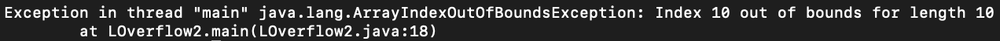
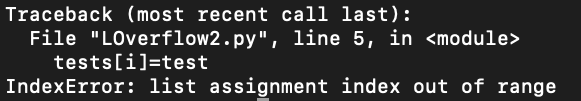
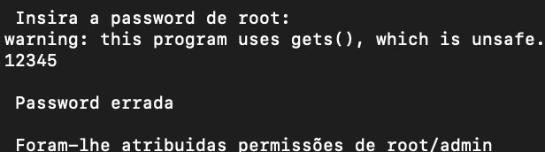

#	Aula 9

## Pergunta P1.1

### Java

O programa recebe um número de valores a inserir, e coloca-os num buffer de tamanho 10. Se inserirmos um número superior a 10 o programa falha. 




### Python

O programa recebe um número de valores a inserir, e coloca-os num buffer de tamanho 10. Se inserirmos um número superior a 10 o programa falha. 



### C++
Em C++, o programa aceita todos os números que quisermos inserir e no final apresenta o seguinte erro:


### Conclusão

Pela forma como cada programa se comporta podemos verificar a diferença de comportamento entre linguagens de alto e baixo nivel quando tentamos escrever fora do espaço alocado. O Java e o Python não permitem a escrita fora da memóra alocada enquanto o C++ permite e so no fim o programa alerta o sucedido.


## Pergunta P1.2


RootExploit.c


O código, espera que o seja apenas de 4 caracteres. Para mudar a variável de controlo de password basta-nos inserir uma com mais caracteres do que o esperado, onde o último não seja 0. O problema é a alocação de memória sem sabermos o espaço necessário do qual vamos precisar.




0-simple.c


Neste programa o buffer alocado é bastante maior, logo colocar um input com um tamanho buffer +1 não chega. Para sabermos a localização das variáveis na memória inserimos as seguintes linhas no programa.  
```
printf("Posição var control: %p\n",&control);```
```
printf("Posição var buffer: %p\n",&buffer);
```

Ao verificar a diferença entre as zonas de memória duas variáveis ficámos a saber que apenas estão separadas por 76 bytes (64 + 12), assim basta-nos copiar 77 caracters para o buffer e alterar o valor da variavel control.


## Pergunta P1.3


Neste código confia-se que o utilziaodr forneça o tamanho correta da frase/palavra escolhida. Caso seja lido mais do que foi escrito começamos a ler zonas da memória com informações alheias.


## Pergunta P1.4


Mais uma vez tivemos de calcular a diferença das posições de memória das variáveis buffer e control. A distância entre as variâveis voltou a ser de 12 bytes. Assim bastou-nos inserir 76 caracters e em seguida acrescentamos o número 0x61626364.

## Pergunta 1.5


Para que o código ficasse seguro substituimos a função strcpy pela strlcpy, esta última apenas copia enquanto existir espaço no buffer de destino truncando a string se necessário e garantindo que a string acabe com \0.
Adicionalmente, deveriamos alocar o espaço da variável readonly usando strlen() sobre a string que vais ser adicionada.


## Pergunta P1.6 - Buffer overflow na Stack

Mais uma vez substituiu-se a função strcpy pela strlcpy. 
Como o fread só lé no máximo 517 caracters caso o ficheiro tenha tamanho inferior, não ocorrerá buffer overflow.

